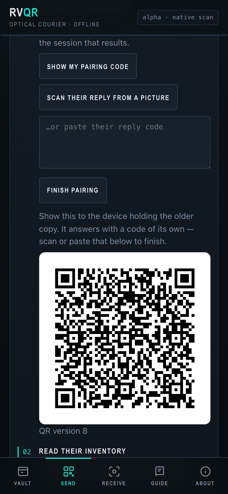
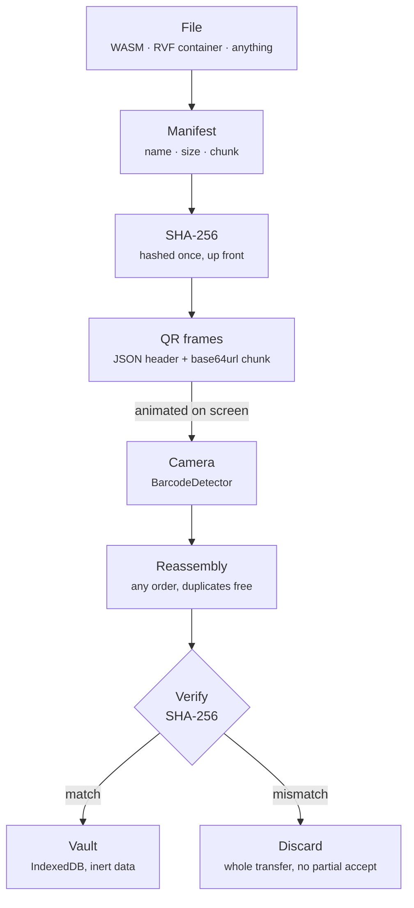

# rvQR

**Move files between devices with a screen and a camera.**

RVF containers and WASM artifacts — offline, no cables, no accounts, nothing to install.

## Try it in 60 seconds ⏱️

1. Open [`./artifacts/`](./artifacts/) on two devices.
2. On the first: **Vault → ruvnet demo .rvf** (a real 2.3 KB RVF container, five QR frames), tap it, then **Send this**.
3. On the second: **Receive → Start camera**, and point it at the first screen. No camera? Photograph the screen and drop the picture in — that works in every browser.
4. Watch the grid fill. When the last frame lands the bytes are hashed, checked against the manifest, and stored.
5. Tap what arrived: real segment table, 24 vectors of 16 dimensions, and a search box that ranks them by distance.

The written walkthrough is [docs/tutorial.md](./docs/tutorial.md); the same
guide is built into the app under the **Guide** tab.

### Two ways to run it

| | |
|---|---|
| **Hosted** | [ruvnet.github.io/rvQR](https://ruvnet.github.io/rvQR/artifacts/) — the normal app. |
| **One file** | [`standalone.html`](https://ruvnet.github.io/rvQR/standalone.html) — the whole app, both demo artifacts and the RVF microkernel inlined into a single ~1.2 MB page. Save it and open it from disk: it makes **no network requests at all**, so it keeps working on a machine that has never been online. Handy for the air-gapped side of a transfer. |

Receiving needs a camera, which browsers only grant on `https://` or a local
file — both of the above qualify. The photo-upload and paste paths work
anywhere, including inside an embedded frame where camera access is refused.

## What is rvQR?

rvQR is optical transfer of RVF cognitive containers and WASM artifacts. Open the same app on two devices. On the first device, load a file from your vault and tap Send—the app animates it as a stream of QR codes on your screen. On the second device, tap Receive and point the camera at the first screen. Watch the progress ring fill as the QR codes decode. When the last frame arrives, the file is verified and stored in your vault.

No internet connection needed. No pairing, no accounts, no setup. The data physically travels from one screen to another, and you can watch it happen.

## The two demo artifacts 📦

Both ship in the repo, and both are real.

| Artifact | Size | Frames | What it shows |
|----------|------|-------:|---------------|
| `ruvnet-demo.rvf` | 2.3 KB | 5 | A genuine RVF container: 4 segments, 24 vectors of 16 dimensions. Transfers in about a second, then you can search it in the browser. |
| `rvf_wasm_bg.wasm` | 40 KB | 82 | The RVF WebAssembly runtime itself, published as `@ruvector/rvf-wasm@0.1.9`. About 16 seconds at the defaults, and a worked example of compile-only module inspection. |

## Screens 📸

| Vault | Send | Receive | Send only what's missing |
|:---:|:---:|:---:|:---:|
|  |  |  |  |
| Stored artifacts, typed and hashed | Frame 7 of 82, QR version 19 | Camera, photo, or pasted by hand | Pairing first, because an inventory is sealed |

## Features ✨

- **Works fully offline**. No WiFi, no cellular, no servers. Optical air-gap transfer at its literal best.
- **Honest about speed**. A single animated QR stream moves 2.5 KB/s at the defaults and 10 KB/s flat out. The 40 KB demo takes about 16 seconds; this is a channel for kilobytes and low megabytes, not for your photo library.
- **Mobile-first**. Designed for phone screens and phone cameras, but works on desktops too.
- **Integrity verified**. Every byte accepted into your vault is checked against the SHA-256 hash from the manifest. A single-bit error causes the entire transfer to be rejected and discarded.
- **RVF-aware**. Detects RVF containers (append-only segment streams with tail-discovered 4096-byte root manifest) and shows their type. Sends and receives them as-is.
- **Real RVF parsing**. Containers are parsed by the actual RVF WebAssembly microkernel — header, segment table, per-segment CRC, vector count and dimensionality — and then searched, with a working nearest-neighbour query over the vectors inside.
- **Holds one copy of what it is receiving, not three**. Each frame is written straight into a single buffer at its own offset and the SHA-256 advances as the bytes land, so the arriving frames and a finished copy of the artifact are never both in memory. Measured on a 1.18 MB artifact that is **1.0024× the artifact against 3.00× before** — and the "before" figure is itself a correction: the older measurement said 2.42× because it sampled memory *after* the hash's temporary padded copy had already been collected, so it could not see one of the three. Two caveats the app does not hide. Below about 5.9 KB the fixed index overhead dominates and the ratio climbs — 1.32× on the 2.3 KB demo container — so the megabyte figure says nothing about a small one. And erasure-coded or compressed transfers cannot stream at all: a fountain symbol has no fixed position to stream *into*, and a declared codec means the digest covers bytes that do not exist yet. Both fall back to the buffered receiver, and the screen names which receiver is holding your transfer and why.
- **Starts before the whole file arrives — and says when that cannot help**. An artifact can be split into four separately signed closures, so an agent runs once the first three verify while the cold state is still coming. The gate is not relaxed to do it; it simply runs four times instead of once. An artifact stuck on three closures is marked **incomplete and sealed**, which is a terminal state rather than a nearly-finished one: a later closure, however valid, is refused *on the seal* without being examined, because "it does not silently acquire the cold state later" only holds if you stop looking. **Over the optical channel this buys nothing**, and the app says so rather than offering it: at the measured 2,440 B/s a three-second budget is 7,320 bytes, while three post-quantum signatures cost 10,119 — the signatures alone exceed the whole budget by 38% before a single content byte, so no split, at any artifact size, reaches a three-second start. That is a radio-tier feature, and there is no radio tier here.
- **Device attestation as evidence, never as permission**. A receiver can present evidence about what it measured at boot, and rvQR checks it — but a device that is measured, approved and current can still be the wrong device to send a credential to, so the permission check is separate and always runs. The screen keeps them apart: "attested, and *separately* granted" is a different outcome from "unattested, and permitted because nobody asked", which is different again from refused. The middle one is deliberately not styled as success, because nobody asking is not an endorsement. **None of the four roots of trust — DICE, TPM 2.0, Secure Enclave, Android hardware keys — is implemented**: the app recognises them as values in the evidence format and says "unexercised" next to each one rather than offering a choice that cannot work. And because attestation evidence identifies a device durably, the page says so above the control that would turn it on.
- **Compresses only when the whole transfer shrinks**. Not when the *payload* shrinks — the transfer. A payload that sheds 8% while the frame count stays put has bought nothing, and the receiver gains a decompressor on its critical path for its trouble. Measured on synthetic float32 vectors, the two rules genuinely disagree in both directions: at 2,816 bytes the payload sheds 8.20% and the transfer only 7.65%, so compression is declined; at 2,304 bytes the payload sheds 7.81% and the transfer 8.31%, so it is accepted — a whole frame dropped out, taking its header and padding with it. Both figures are always on screen. On incompressible input the transfer *grows* and compression is refused, and the panel says so rather than quietly sending it uncompressed.
- **Honest about what your browser can do**. rvQR runs in a browser, and browsers offer `deflate-raw` but neither Brotli nor Zstd (verified by construction in Chrome 140). So the app uses what the platform actually has and names it: **55.91%** smaller on the demo WASM module where Brotli would manage 63.69%, and **21.07%** on the demo container against 23.39%. A six-to-eight point gap, stated as a fact rather than dressed up as a limitation — and the app never offers a codec the platform lacks.
- **Picks the route, and shows its reasoning**. Before a send, rvQR scores the available strategies — protocol version, delta granularity, frame size, whether to use fountain coding — and explains which it chose. Four rules sit *outside* that scoring and cannot be outvoted by it: an unverified peer is not a transfer partner, projected memory stays under 128 MiB, an offline policy forbids every radio, and a transfer that commits its result may not rest on a partial verification. They are applied as a filter before anything is scored, because a safety rule expressed as a large penalty is not a safety rule — a confident enough score beats any finite penalty. Rejected options are listed with the rule that rejected them, since a control you cannot see may as well not have run.
- **Sends only what changed**. If the receiver already holds an older copy, rvQR compares two ways of describing the difference and sends the smaller. The coarse one resends whole segments; the fine one diffs *inside* them — individual vector records, WASM function bodies, copy-on-write cluster maps. On a 1.13 MB container with a handful of edits that is 40,285 bytes instead of 1,125,630. The fine diff is not always right: it carries a table naming every unit, and when that table costs more than it saves the coarse diff wins instead. The panel tells you which one it picked and why, because a tool that silently changes strategy cannot be debugged by the person holding it.
- **Scans without a native decoder**. Where the browser has no `BarcodeDetector` (Firefox, older Safari), rvQR falls back to its own bundled QR decoder rather than giving up.
- **Decode from a picture**. Photograph or screenshot the sending screen and drop the image in; every frame visible in it is read at once. No camera permission needed, works in any browser.
- **WASM inspection**. Compile-only analysis of WebAssembly modules—lists all exported names without instantiating or executing the code.
- **Drag and drop**. Import artifacts by file picker or drag them into the vault.
- **Pause and restart**. Control the send animation; skip ahead with the frame scrubber.
- **Camera fallback**. No BarcodeDetector? Paste a QR frame by hand as text.

## Status: Alpha ⚠️

The core send/receive loop and the artifact vault are working today. Below are the features that are still roadmap:

| Feature | Status | Notes |
|---------|--------|-------|
| Single-QR-stream send/receive | ✅ Implemented | v1 protocol, deterministic frames, SHA-256 verification |
| Artifact vault (storage, import, export, WASM inspection) | ✅ Implemented | IndexedDB-backed, no server sync |
| RVF container parsing and vector search | ✅ Implemented | Real `@ruvector/rvf-wasm` microkernel; segment table, CRC fingerprints, nearest-neighbour query |
| Bundled QR decoder + image-upload receive | ✅ Implemented | Used where `BarcodeDetector` is missing; reads several frames from one picture |
| Erasure-coded frames | 🚧 Built, not yet wired in | A systematic GF(256) fountain code with RaptorQ's block structure — **RaptorQ-structured, deliberately not RFC 6330 conformant, and it will not interoperate with a conformant codec**. Any K+ε symbols reconstruct the object regardless of which arrive. Lives in `artifacts/fountain.js`; the transport still uses fixed indexed chunks. |
| Delta segment transfer | 🗺️ Roadmap | Receiver displays its root manifest; sender diffs and sends only the missing RVF segments. Moves ~100× less data for a 1 GB container with 1% changed — about 29 hours down to 18 minutes at this app's measured rate. |
| Signed manifest verification | 🗺️ Roadmap | Detached signatures via rvf-crypto; pinned key on receiver |
| BitChat session bootstrap | 🗺️ Roadmap | X25519 public-key exchange QR; HKDF-SHA256 session key derivation; encrypted optical payloads |
| Resume after browser termination | 🗺️ Roadmap | Persist transfer state; resume from last received frame |

See [docs/protocol.md](./docs/protocol.md) for the wire format and roadmap, [docs/tutorial.md](./docs/tutorial.md) for the walkthrough, and [docs/ecosystem.md](./docs/ecosystem.md) for how the pieces fit together.

## Architecture



## Security Model 🔒

**Transport is not trust.** The optical channel moves bytes; it does not authorize execution.

- **Integrity is mandatory.** Every byte is verified against the manifest hash before storage. A single mismatch discards the entire transfer — there is no partial acceptance.
- **Integrity is not authenticity.** The hash proves the bytes arrived intact. It says nothing about who sent them, because the manifest travels in the same unauthenticated stream as the payload. Anyone who can put a screen in front of your camera can produce a perfectly valid transfer of anything they like. Treat a received artifact the way you would treat a file downloaded from a stranger — that is precisely what it is.
- **WASM is never instantiated.** Compile-only inspection lists exports and imports without executing any code.
- **Nothing runs on arrival.** Received bytes land in IndexedDB as inert data, tagged with where they came from and shown with a `received` badge in the vault. rvQR itself never executes an artifact, and nothing in the app turns one into something that runs.
- **A pinned fingerprint is now enforced, not advertised.** Pin a signer's fingerprint and a transfer signed by any other key — or by no key — is refused *before anything is written*. The check is a pure function (`core.admitArtifact`): a verification that has not finished yet never admits, and an unrecognised verdict fails closed rather than falling through. Without a pin the behaviour is unchanged, because you have named no signer and integrity is then the whole contract.
- **What is still missing.** Received and imported artifacts share one store, and nothing yet requires an explicit acknowledgement before a received artifact can leave the vault. The signing key lives in plaintext `localStorage` — fine for a demonstration, wrong for production, which wants a platform key store, a hardware-backed key, or WebAuthn-controlled signing. See [docs/protocol.md](./docs/protocol.md).

## Protocol

There are two frame formats. **v1 (JSON) is the default**; v2 (binary) is
selectable under transfer settings. The manifest states which is in use, so a
receiver never has to infer it, and the two are separate state machines — fed
the wrong format each names it (`v1-frame`, `not-a-frame`) rather than
mis-decoding.

**Why v2 exists, and what it actually buys.** v1 spends 44% of every QR symbol
on JSON and base64url. v2 uses a 28-byte binary header carrying an explicit
codec id, dictionary id, original and compressed sizes, and both a transport
hash and the original content hash. But neither QR decoder this app can reach —
the browser's `BarcodeDetector` or the bundled one — returns bytes; both return
a string. So v2 frames are ASCII-armoured at 8/7, and the realised gain is
**1.30× v1's default chunk** (1.209× against v1's largest) at version 19-L,
rising to 2.5× at version 40 where v1 is capped. The unarmoured binary frame is
denser still, and unusable: it does not survive the round trip. Measured in
[docs/benchmarks.md](./docs/benchmarks.md) §1.

The v1 protocol is minimal and deterministic. A frame is one QR code containing one UTF-8 JSON string.

**Manifest frame (always sequence 0):**
```json
{"v":1,"t":"<8 hex, random transfer id>","h":"<first 8 hex of SHA-256>","i":0,"n":<total frames>,"m":{"name":"<file name>","size":<bytes>,"sha256":"<64 hex>","chunk":<bytes>}}
```

**Data frame (sequence 1 through n-1):**
```json
{"v":1,"t":"<same transfer id>","h":"<same 8 hex>","i":<sequence>,"n":<total>,"p":"<base64url payload>"}
```

Frames may arrive in any order and duplicates are free. Unknown protocol
versions, inconsistent hash prefixes and absurd frame counts are dropped. Frames
belonging to a *different* transfer are ignored while the current one is still
progressing, and adopted once it has visibly stalled — so a stray frame cannot
hijack a live transfer, and a sender that restarts is picked up automatically
rather than stonewalled. When the manifest has arrived and every sequence is
present, the payloads are concatenated in order, the SHA-256 is verified, and
only then is the artifact stored.

See [docs/protocol.md](./docs/protocol.md) for implementation detail and the roadmap (erasure-coded frames, delta transfer, BitChat, signed manifests), and [ADR-001](./docs/adr/ADR-001-rvqr-optical-transport.md) for why v1 shipped with fixed indexed chunks.

## Relationship to RuVector and RVF

rvQR is a transport layer for [RuVector](https://github.com/ruvnet/RuVector) artifacts and RVF cognitive containers.

- **RVF container format**: Append-only segment streams with a 4096-byte root manifest discovered at the tail. Segment magic bytes `53 46 56 52` ("SFVR"), root manifest magic `30 4D 56 52` ("0MVR"). See ADR-009 in the RuVector repository.
- **WASM runtime**: [`@ruvector/rvf-wasm`](https://www.npmjs.com/package/@ruvector/rvf-wasm) `0.1.9` is the RVF WebAssembly runtime. The copy bundled here as the demo artifact is that exact binary — 40,989 bytes, which the app shows as 40.0 KB and npm advertises as 39 KB — carried as cargo rather than run.

The crates, packages and evaluation layer around all this are laid out below.

## Ecosystem 🧩

Three surfaces touch the same format, plus an evaluation layer. The deeper
version — how each piece plugs into rvQR's send and receive paths — is in
[docs/ecosystem.md](./docs/ecosystem.md).

**Web UI — [`artifacts/`](./artifacts/), this repository.** The vault, the QR
sender, the camera receiver, compile-only WASM inspection. The only surface that
moves an artifact between two devices with no shared network.

**Rust crates** — in [ruvnet/RuVector](https://github.com/ruvnet/RuVector), under `crates/rvf/`:

| Crate | Role |
|-------|------|
| [`rvf-types`](https://github.com/ruvnet/RuVector/tree/main/crates/rvf/rvf-types) | Wire constants and header structs, including `SEGMENT_MAGIC_BYTES` and `ROOT_MANIFEST_MAGIC_BYTES` per [ADR-009](./docs/adr/ADR-009-rvf-v1-wire-contract.md) |
| [`rvf-wire`](https://github.com/ruvnet/RuVector/tree/main/crates/rvf/rvf-wire) | Segment codec, tail scan (`find_latest_manifest`), golden byte vectors gated in CI |
| [`rvf-runtime`](https://github.com/ruvnet/RuVector/tree/main/crates/rvf/rvf-runtime) | The store: open, ingest, query, copy-on-write derive, durable metadata |
| [`rvf-crypto`](https://github.com/ruvnet/RuVector/tree/main/crates/rvf/rvf-crypto) | Signing, verification, witness chain — the roadmap signature layer |

**npm packages:**

| Package | Role |
|---------|------|
| [`@ruvector/rvf-wasm`](https://www.npmjs.com/package/@ruvector/rvf-wasm) `0.1.9` | The RVF WebAssembly runtime. rvQR's demo artifact *is* this binary, 40,989 bytes — carried, never loaded |
| [`@ruvector/rvf`](https://www.npmjs.com/package/@ruvector/rvf) | The Node.js RVF store |
| [`ruvector`](https://www.npmjs.com/package/ruvector) | The full vector database; RVF is its portable format |

**[metaharness](https://github.com/ruvnet/metaharness)** is the evaluation and
governance layer. rvQR's acceptance bar — 100 transfers of 100 MB, zero
incorrectly accepted files, recovery under 20% frame loss — is written to be
run as metaharness-gated benchmarks, with correctness gates binary and
throughput scored, so no amount of speed can offset a false accept. The receive
path already produces what a witness record wants (manifest hash, computed hash,
verdict, frame and duplicate counts), so transfers could be scored over attested
outcomes rather than self-reported ones. To be clear: **this is design intent,
not shipped integration** — there are no gate definitions or witness emission in
this repository today. See [docs/ecosystem.md](./docs/ecosystem.md) for the sketch.

## Architecture Decision Records 📐

rvQR carries RVF containers but does not define the format. The decisions that
do are mirrored, with provenance headers, under
[docs/adr/](./docs/adr/README.md) — grouped by wire contract, cognitive
containers and WASM, transfer and federation, and QR. Start with
[ADR-009](./docs/adr/ADR-009-rvf-v1-wire-contract.md), the normative wire
contract this app's type detection implements, and
[ADR-034](./docs/adr/ADR-034-qr-cognitive-seed.md), which solves the
single-symbol case rvQR complements by streaming.

## Browser Support 🌐

**Send works everywhere.** Animating QR codes requires only Canvas, which all modern browsers support.

**Receiving works everywhere**, by one of three routes:

- **Native scanning** where the browser has `BarcodeDetector` — Chrome and Edge, and Safari 17 and later. Fastest, and what rvQR uses when it is available.
- **The bundled decoder** everywhere else, including Firefox and older Safari. It is dependable on smaller symbols and wants a sharper image on the densest ones: good to about version 16 on a blurry camera frame, and to version 40 on a sharp screenshot. Sending at a 256-byte chunk keeps every frame comfortably inside that range.
- **A picture, or pasted text.** Both work in any browser with no camera at all. The picture route is also the answer when rvQR is embedded in a page that does not grant camera access — a restriction set by the surrounding page, which the app detects and explains.

## Testing 🧪

Open [`artifacts/test.html`](./artifacts/test.html) to run the self-tests in your browser. It exercises frame encoding, out-of-order and duplicate reassembly, hash-mismatch rejection, the QR encoder's structure, the decoder (encode → pixels → decode, including damaged symbols), and RVF parsing against the real demo container — no camera or second device needed — and renders two live QR codes you can scan with any reader to confirm the encoder produces real, readable symbols.

That page covers the app suite — 166 assertions. Fourteen further suites run under
Node only, because they need timing, forced garbage collection or containers too
large to be comfortable in a browser tab: perf (60), swarm (52), planner (47), closure (46), compress (44), crypto (44),
fountain (39), attest (38), semdelta (34), delta (31), pipeline (30), proto2 (30), expiry (25) and
provenance (23). 709 in total.

### Two modules the page does not load

`swarm.js` and `p2p.js` ship in this repository and are **not reachable from the
app**, which is stated here rather than left for someone to discover.

`swarm.js` distributes one artifact across a fleet of devices trading verified
chunks, so a source link sends far less than one copy per device — measured at
**1.42× the artifact for 100 devices** against 100× point-to-point. But that
measurement is of a *simulation*: byte and chunk counts are real, timings are
simulation ticks, and no fleet exists here to run it on. It also needs a peer
transport, and `p2p.js` — the WebRTC one — is itself unwired. A swarm panel in a
two-device optical tool would imply a capability the app does not have, so the
module ships as a tested library and the page does not load it. The security
property is the part worth having regardless: a peer is a transport, not an
authority, and chunks from a different signed artifact are refused by every
receiver before they are even hashed.

```bash
for f in artifacts/*.test.js; do node "$f"; done
node --expose-gc artifacts/proto2.test.js   # 2 of its 30 SKIP without this flag
```

The `--expose-gc` note is not incidental. Those two tests measure retained
memory after a forced collection, and without the flag they skip while the
suite still prints a total — a green summary covering tests that never ran.

Performance claims in [`docs/benchmarks.md`](./docs/benchmarks.md) come from
`node bench/index.mjs`, which records the machine, the commit, and every module
it measured alongside the numbers.

The same assertions run under Node:

```bash
node -e "const c=require('./artifacts/core.js'),q=require('./artifacts/vendor/qrcode.js'),t=require('./artifacts/tests.js');
const r=t.runAll(c,q); r.forEach(x=>console.log((x.ok?'ok  ':'FAIL')+' '+x.name));
const s=t.summarize(r); console.log(s.passed+'/'+s.total+' passed'); process.exit(s.failed?1:0);"
```

## Contributing

Contributions are welcome. Please open an issue or pull request on [github.com/ruvnet/rvQR](https://github.com/ruvnet/rvQR). For the RVF format itself, see the [RuVector](https://github.com/ruvnet/RuVector) repository.

## License

MIT License. Copyright (c) 2026 rUv. See [LICENSE](./LICENSE) for details.
