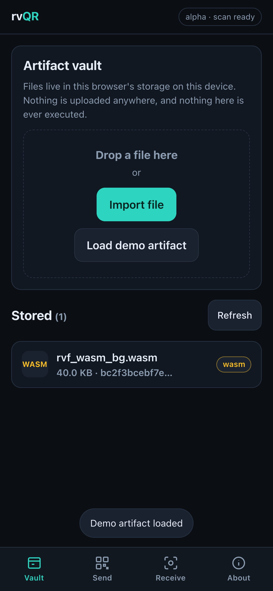
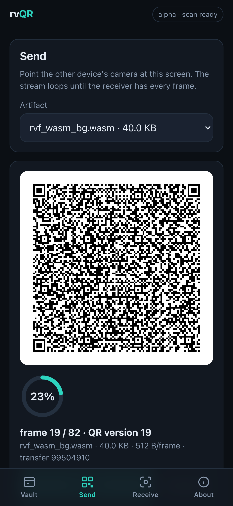
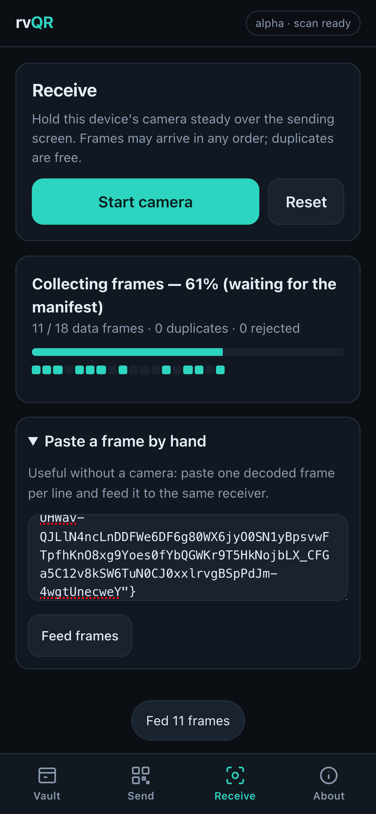
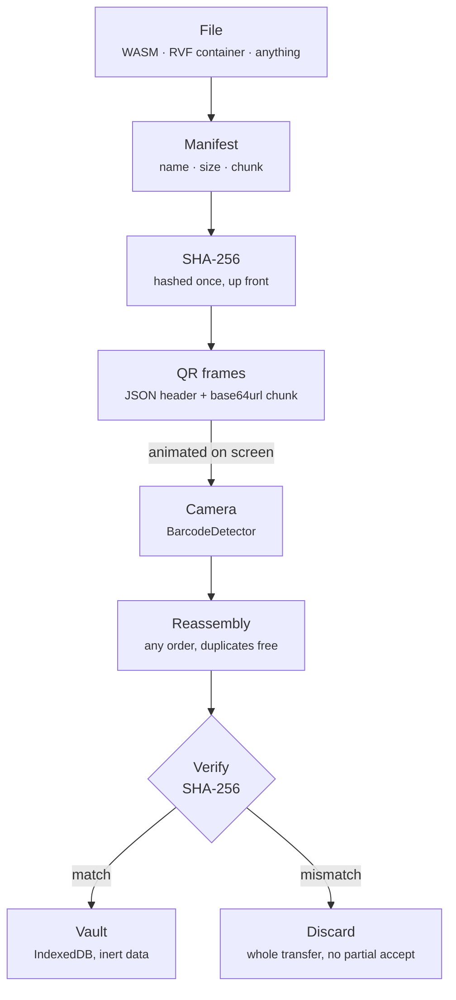

# rvQR

Move files between devices using a screen and a camera. No network, no cables, no accounts.

## What is rvQR?

rvQR is optical transfer of RVF cognitive containers and WASM artifacts. Open the same app on two devices. On the first device, load a file from your vault and tap Send—the app animates it as a stream of QR codes on your screen. On the second device, tap Receive and point the camera at the first screen. Watch the progress ring fill as the QR codes decode. When the last frame arrives, the file is verified and stored in your vault.

No internet connection needed. No pairing, no accounts, no setup. The data physically travels from one screen to another, and you can watch it happen.

## Quick Start 📱

1. Open [`./artifacts/`](./artifacts/) in your browser on two phones (or a phone and a laptop).
2. On the first device, tap **Load demo artifact** to drop the 40 KB `rvf_wasm_bg.wasm` module into your vault.
3. Tap that artifact to open its detail sheet, then tap **Send this**. The QR stream starts immediately and loops.
4. On the second device, open the **Receive** tab, tap **Start camera**, allow access, and hold it over the first screen.
5. Watch the progress ring fill and the frame grid light up cell by cell. At 82 frames and 5 frames per second, the demo artifact takes about 17 seconds per pass.
6. Tap the file in the second device's vault to confirm it arrived intact.

## Screens 📸

| Vault | Send | Receive |
|:---:|:---:|:---:|
|  |  |  |
| Stored artifacts, typed and hashed | Frame 19 of 82, QR version 19 | Frames landing out of order, 56% in |

## Features ✨

- **Works fully offline**. No WiFi, no cellular, no servers. Optical air-gap transfer at its literal best.
- **Honest about speed**. A single animated QR stream moves 2.5 KB/s at the defaults and 10 KB/s flat out. The 40 KB demo takes about 16 seconds; this is a channel for kilobytes and low megabytes, not for your photo library.
- **Mobile-first**. Designed for phone screens and phone cameras, but works on desktops too.
- **Integrity verified**. Every byte accepted into your vault is checked against the SHA-256 hash from the manifest. A single-bit error causes the entire transfer to be rejected and discarded.
- **RVF-aware**. Detects RVF containers (append-only segment streams with tail-discovered 4096-byte root manifest) and shows their type. Sends and receives them as-is.
- **WASM inspection**. Compile-only analysis of WebAssembly modules—lists all exported names without instantiating or executing the code.
- **Drag and drop**. Import artifacts by file picker or drag them into the vault.
- **Pause and restart**. Control the send animation; skip ahead with the frame scrubber.
- **Camera fallback**. No BarcodeDetector? Paste a QR frame by hand as text.

## Status: Alpha ⚠️

The core send/receive loop and the artifact vault are working today. Below are the features that are still roadmap:

| Feature | Status | Notes |
|---------|--------|-------|
| Single-QR-stream send/receive | ✅ Implemented | v1 protocol, deterministic frames, SHA-256 verification |
| Artifact vault (storage, import, export, WASM inspection) | ✅ Implemented | IndexedDB-backed, no server sync |
| RaptorQ fountain coding | 🗺️ Roadmap | RFC 6330 encoding symbols; receiver reconstructs after K+ε symbols regardless of which ones arrive |
| Delta segment transfer | 🗺️ Roadmap | Receiver displays its root manifest; sender diffs and sends only the missing RVF segments. Moves ~100× less data for a 1 GB container with 1% changed — about 29 hours down to 18 minutes at this app's measured rate. |
| Signed manifest verification | 🗺️ Roadmap | Detached signatures via rvf-crypto; pinned key on receiver |
| BitChat session bootstrap | 🗺️ Roadmap | X25519 public-key exchange QR; HKDF-SHA256 session key derivation; encrypted optical payloads |
| Resume after browser termination | 🗺️ Roadmap | Persist transfer state; resume from last received frame |

See [docs/protocol.md](./docs/protocol.md) for technical detail on the roadmap items.

## Architecture



## Security Model 🔒

**Transport is not trust.** The optical channel moves bytes; it does not authorize execution.

- **Integrity is mandatory.** Every byte is verified against the manifest hash before storage. A single mismatch discards the entire transfer — there is no partial acceptance.
- **Integrity is not authenticity.** The hash proves the bytes arrived intact. It says nothing about who sent them, because the manifest travels in the same unauthenticated stream as the payload. Anyone who can put a screen in front of your camera can produce a perfectly valid transfer of anything they like. Treat a received artifact the way you would treat a file downloaded from a stranger — that is precisely what it is.
- **WASM is never instantiated.** Compile-only inspection lists exports and imports without executing any code.
- **Nothing runs on arrival.** Received bytes land in IndexedDB as inert data, tagged with where they came from and shown with a `received` badge in the vault. rvQR itself never executes an artifact, and nothing in the app turns one into something that runs.
- **But there is no trust gate yet.** Received and imported artifacts share one store, and the origin tag is a label, not an enforcement point: nothing blocks you from exporting a received file. A real quarantine — signature verification against a pinned key, and an explicit acknowledgement before a received artifact can leave the vault — is roadmap, not shipped. See [docs/protocol.md](./docs/protocol.md).

## Protocol

The protocol is minimal and deterministic. A frame is one QR code containing one UTF-8 JSON string.

**Manifest frame (always sequence 0):**
```json
{"v":1,"t":"<8 hex, random transfer id>","h":"<first 8 hex of SHA-256>","i":0,"n":<total frames>,"m":{"name":"<file name>","size":<bytes>,"sha256":"<64 hex>","chunk":<bytes>}}
```

**Data frame (sequence 1 through n-1):**
```json
{"v":1,"t":"<same transfer id>","h":"<same 8 hex>","i":<sequence>,"n":<total>,"p":"<base64url payload>"}
```

Frames may arrive in any order and duplicates are free. Unknown protocol
versions, inconsistent hash prefixes and absurd frame counts are dropped. Frames
belonging to a *different* transfer are ignored while the current one is still
progressing, and adopted once it has visibly stalled — so a stray frame cannot
hijack a live transfer, and a sender that restarts is picked up automatically
rather than stonewalled. When the manifest has arrived and every sequence is
present, the payloads are concatenated in order, the SHA-256 is verified, and
only then is the artifact stored.

See [docs/protocol.md](./docs/protocol.md) for implementation detail and the roadmap (RaptorQ, delta transfer, BitChat, signed manifests).

## Relationship to RuVector and RVF

rvQR is a transport layer for [RuVector](https://github.com/ruvnet/RuVector) artifacts and RVF cognitive containers.

- **RVF container format**: Append-only segment streams with a 4096-byte root manifest discovered at the tail. Segment magic bytes `53 46 56 52` ("SFVR"), root manifest magic `30 4D 56 52` ("0MVR"). See ADR-009 in the RuVector repository.
- **WASM runtime**: [`@ruvector/rvf-wasm`](https://www.npmjs.com/package/@ruvector/rvf-wasm) `0.1.9` is the RVF WebAssembly runtime. The copy bundled here as the demo artifact is that exact binary — 40,989 bytes, which the app shows as 40.0 KB and npm advertises as 39 KB — carried as cargo rather than run.

The crates, packages and evaluation layer around all this are laid out below.

## Ecosystem 🧩

Three surfaces touch the same format, plus an evaluation layer. The deeper
version — how each piece plugs into rvQR's send and receive paths — is in
[docs/ecosystem.md](./docs/ecosystem.md).

**Web UI — [`artifacts/`](./artifacts/), this repository.** The vault, the QR
sender, the camera receiver, compile-only WASM inspection. The only surface that
moves an artifact between two devices with no shared network.

**Rust crates** — in [ruvnet/RuVector](https://github.com/ruvnet/RuVector), under `crates/rvf/`:

| Crate | Role |
|-------|------|
| [`rvf-types`](https://github.com/ruvnet/RuVector/tree/main/crates/rvf/rvf-types) | Wire constants and header structs, including `SEGMENT_MAGIC_BYTES` and `ROOT_MANIFEST_MAGIC_BYTES` per [ADR-009](./docs/adr/ADR-009-rvf-v1-wire-contract.md) |
| [`rvf-wire`](https://github.com/ruvnet/RuVector/tree/main/crates/rvf/rvf-wire) | Segment codec, tail scan (`find_latest_manifest`), golden byte vectors gated in CI |
| [`rvf-runtime`](https://github.com/ruvnet/RuVector/tree/main/crates/rvf/rvf-runtime) | The store: open, ingest, query, copy-on-write derive, durable metadata |
| [`rvf-crypto`](https://github.com/ruvnet/RuVector/tree/main/crates/rvf/rvf-crypto) | Signing, verification, witness chain — the roadmap signature layer |

**npm packages:**

| Package | Role |
|---------|------|
| [`@ruvector/rvf-wasm`](https://www.npmjs.com/package/@ruvector/rvf-wasm) `0.1.9` | The RVF WebAssembly runtime. rvQR's demo artifact *is* this binary, 40,989 bytes — carried, never loaded |
| [`@ruvector/rvf`](https://www.npmjs.com/package/@ruvector/rvf) | The Node.js RVF store |
| [`ruvector`](https://www.npmjs.com/package/ruvector) | The full vector database; RVF is its portable format |

**[metaharness](https://github.com/ruvnet/metaharness)** is the evaluation and
governance layer. rvQR's acceptance bar — 100 transfers of 100 MB, zero
incorrectly accepted files, recovery under 20% frame loss — is written to be
run as metaharness-gated benchmarks, with correctness gates binary and
throughput scored, so no amount of speed can offset a false accept. The receive
path already produces what a witness record wants (manifest hash, computed hash,
verdict, frame and duplicate counts), so transfers could be scored over attested
outcomes rather than self-reported ones. To be clear: **this is design intent,
not shipped integration** — there are no gate definitions or witness emission in
this repository today. See [docs/ecosystem.md](./docs/ecosystem.md) for the sketch.

## Architecture Decision Records 📐

rvQR carries RVF containers but does not define the format. The decisions that
do are mirrored, with provenance headers, under
[docs/adr/](./docs/adr/README.md) — grouped by wire contract, cognitive
containers and WASM, transfer and federation, and QR. Start with
[ADR-009](./docs/adr/ADR-009-rvf-v1-wire-contract.md), the normative wire
contract this app's type detection implements, and
[ADR-034](./docs/adr/ADR-034-qr-cognitive-seed.md), which solves the
single-symbol case rvQR complements by streaming.

## Browser Support 🌐

**Send works everywhere.** Animating QR codes requires only Canvas, which all modern browsers support.

**Receive requires BarcodeDetector.** This is a native API implemented in:
- Chrome and Edge on Android and desktop
- Safari 17 and later on iOS and macOS
- Older Safari versions can send but cannot receive; no heavy JavaScript decoder is bundled.

If your device does not support BarcodeDetector, use the text-paste fallback: manually copy a frame as text from the sender's screen and paste it into the Receive form.

## Testing 🧪

Open [`artifacts/test.html`](./artifacts/test.html) to run the self-tests in your browser. It exercises frame encoding, out-of-order and duplicate reassembly, hash-mismatch rejection, and the QR encoder's structure — no camera or second device needed — and renders two live QR codes you can scan with any reader to confirm the encoder produces real, readable symbols.

The same assertions run under Node:

```bash
node -e "const c=require('./artifacts/core.js'),q=require('./artifacts/vendor/qrcode.js'),t=require('./artifacts/tests.js');
const r=t.runAll(c,q); r.forEach(x=>console.log((x.ok?'ok  ':'FAIL')+' '+x.name));
const s=t.summarize(r); console.log(s.passed+'/'+s.total+' passed'); process.exit(s.failed?1:0);"
```

## Contributing

Contributions are welcome. Please open an issue or pull request on [github.com/ruvnet/rvQR](https://github.com/ruvnet/rvQR). For the RVF format itself, see the [RuVector](https://github.com/ruvnet/RuVector) repository.

## License

MIT License. Copyright (c) 2026 rUv. See [LICENSE](./LICENSE) for details.
